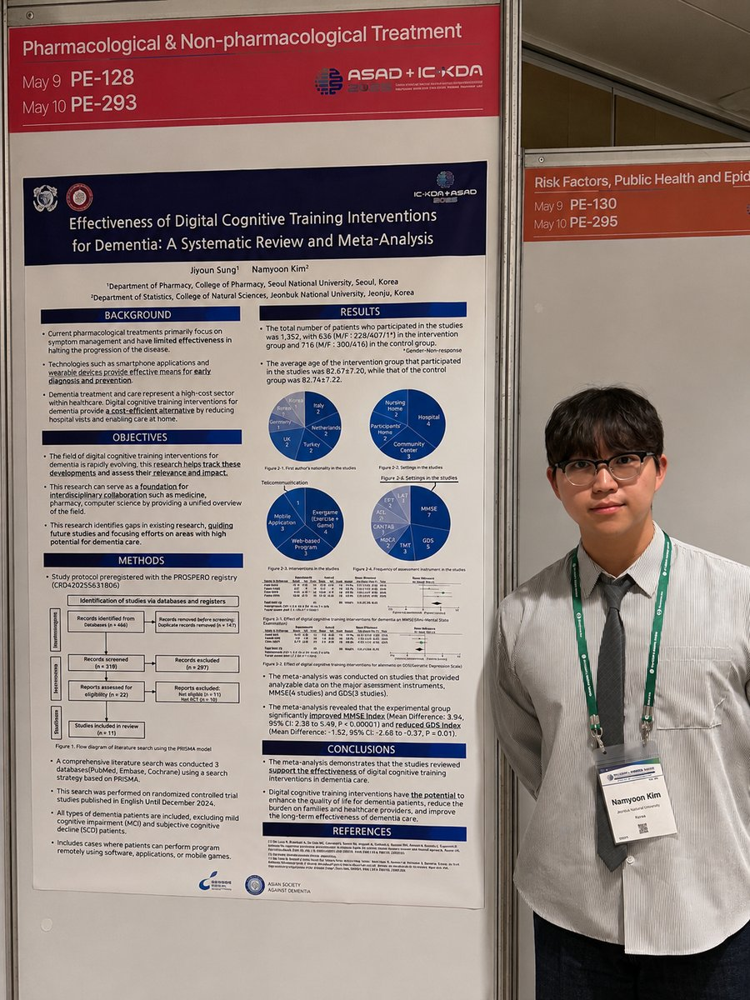
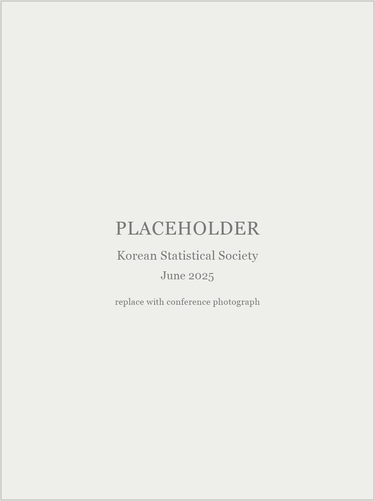
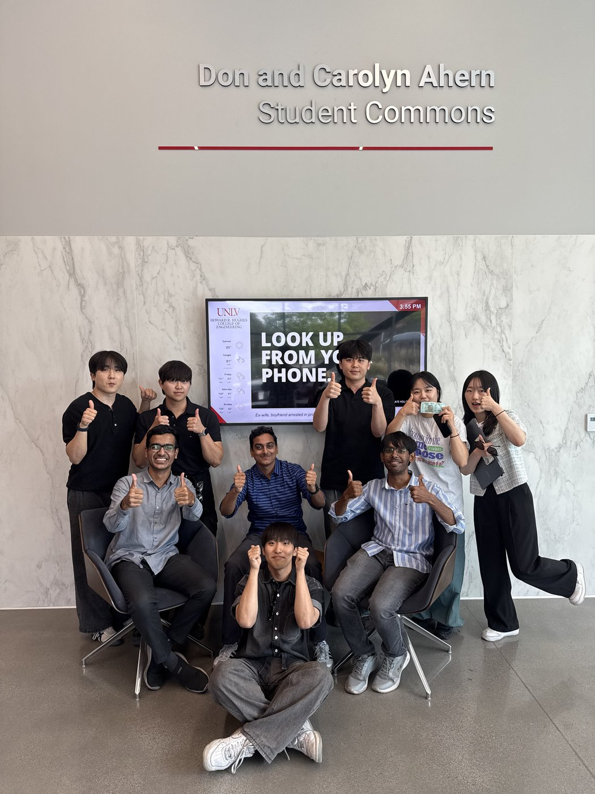

## Conference presentations

::: {.photo-entry}

::: {.photo-media}
{fig-alt="Nam-Yoon Kim standing beside the dementia meta-analysis poster at IC-KDA + ASAD 2025"}
:::

::: {.photo-body}
### 2025. 05. {.photo-title}

- Poster presentation, **IC-KDA + ASAD 2025 @ Seoul**
- **Best Poster Award**
:::

:::

::: {.photo-entry}

::: {.photo-media}
{fig-alt="Nam-Yoon Kim standing beside the neural Granger causality poster at the Korean Statistical Society Summer Conference"}
:::

::: {.photo-body}
### 2025. 06. {.photo-title}

- Poster presentation, **Korean Statistical Society Summer Conference @ Gyeongju**
:::

:::

## Research visits

::: {.photo-entry}

::: {.photo-media}
{fig-alt="Group photograph of the summer research programme participants at the Don and Carolyn Ahern Student Commons, UNLV"}
:::

::: {.photo-body}
### 2025. 06. – 07. {.photo-title}

- Summer research program, **University of Nevada, Las Vegas**
- Supervised by Dr. Mingon Kang
:::

:::

## Other activities

PLACEHOLDER: anything else worth showing — student statistics society, seminars
or reading groups, data competitions, volunteering, tutoring, or departmental
events. A line each is enough, and photographs are welcome.

<!-- To add another entry, copy this block and change the three parts:

::: {.photo-entry}

::: {.photo-media}
{fig-alt="Short description for screen readers"}
:::

::: {.photo-body}
### 2025. 09. {.photo-title}

- What it was, **where it happened**
:::

:::

Send me photographs at any size - I will resize them for the web. -->
