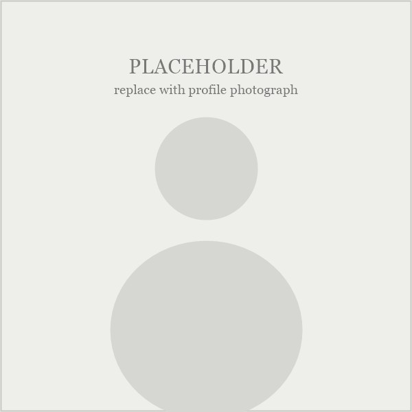

::: {.profile-block}

::: {.profile-photo}
{fig-alt="Portrait of Nam-Yoon Kim" class="profile-img"}
:::

::: {.profile-text}

I am an undergraduate researcher at Jeonbuk National University, majoring in
Statistics with a minor in Mathematics, and applying to PhD programs in
Statistics and Biostatistics.

Most of my work so far has been on health data, but what pulls me into a problem
is usually the statistical question rather than the subject area — whether a
method still holds once its assumptions are loosened, and whether a result
survives being moved somewhere new. That has taken me into weather time series
and network models as readily as into hospital records.

<!-- PLACEHOLDER (optional): one or two sentences in your own voice. What got you
     into statistics, what you find satisfying about it, or what you do outside
     research. Two honest sentences here do more than another paragraph of
     methods. Delete this comment once written, or delete nothing if you would
     rather keep the page purely professional. -->

::: {.profile-links}
<a href="https://github.com/gimnamyun5" class="icon-link" aria-label="GitHub" title="GitHub"><i class="bi bi-github"></i></a>
<a href="https://www.linkedin.com/in/namyoon-kim-3b7b32416/" class="icon-link" aria-label="LinkedIn" title="LinkedIn"><i class="bi bi-linkedin"></i></a>
<a href="mailto:namyoon2000@jbnu.ac.kr" class="icon-link" aria-label="Email" title="Email"><i class="bi bi-envelope"></i></a>
:::

<!-- The links are raw HTML so that the Bootstrap icon markup survives, and
     because a Markdown mailto link would be rewritten by Pandoc's email
     obfuscation and lose its styling. -->

:::

:::

## Education

**B.S. in Statistics**, minor in Mathematics — Jeonbuk National University (JBNU) \
March 2021 – February 2027 (expected)

## Research experience

- **Feb 2026 – present**: Undergraduate Researcher, Statistical Learning Across
  Biomedicine (S-LAB), Jeonbuk National University
- **Jun 2025 – Jul 2025**: Visiting Student Researcher, University of Nevada,
  Las Vegas

::: {.card-grid}

::: {.info-card .awards-card}
::: {.card-label}
Awards & scholarships
:::
- **Best Poster Award** — IC-KDA + ASAD 2025
- **President's Award for Academic Excellence** — Jeonbuk National University, 2025
- **Full Merit-Based Scholarship** — Fall 2024 – Spring 2026
:::

::: {.info-card}
::: {.card-label}
Research interests
:::
- Biostatistics
- Statistical machine learning
- Clinical prediction modeling
- Statistical network analysis
- Time series and causal discovery
:::

::: {.info-card}
::: {.card-label}
Teaching
:::
- TA · Introduction to Big Data, Fall 2025
- TA · Understanding and Application of Big Data, Spring 2025
- TA · Statistical Thinking and Society, Fall 2024
:::

:::
